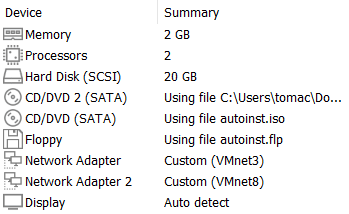
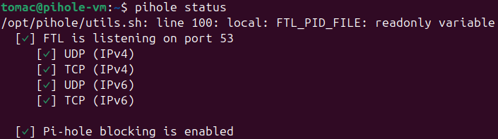
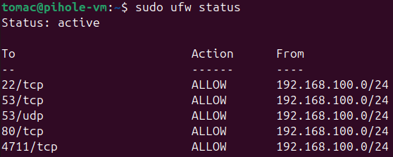
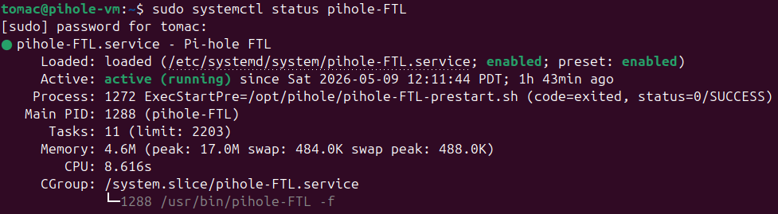
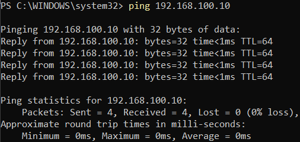
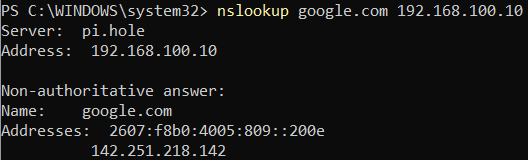
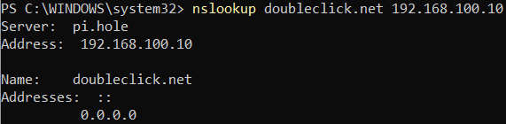
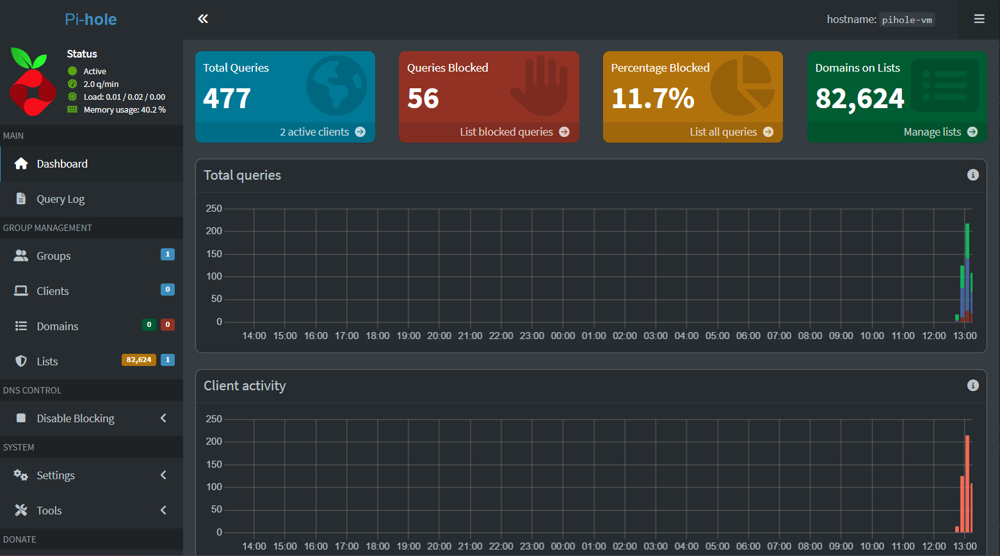
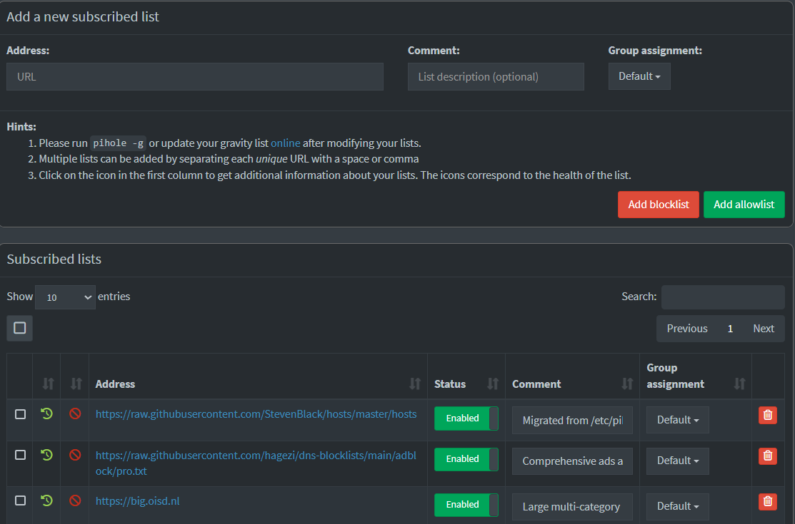

# Pi-Hole Deployment Guide

---

## Prerequisites

This guide assumes the following:
- VMware Workstation Pro is installed on the host machine
- No prior virtual machines have been configured

This guide must be completed before proceeding to:
- [Splunk Server Deployment](../splunk-server/splunk-guide.md)
- [Splunk Universal Forwarder Deployment](../splunk-forwarder/pihole-forwarder-setup.md)

---

## Table of Contents

1. [Purpose](#1-purpose)
2. [Required Technologies](#2-required-technologies)
3. [Virtual Machine Specifications](#3-virtual-machine-specifications)
4. [Network Configuration](#4-network-configuration)
5. [Ubuntu Installation](#5-ubuntu-installation)
6. [Pi-Hole Installation](#6-pi-hole-installation)
7. [Virtual Machine Hardening](#7-virtual-machine-hardening)
8. [Testing and Verification](#8-testing-and-verification)

---

## 1. Purpose

This guide covers the deployment and configuration of a Pi-Hole virtual machine within a homelab SIEM environment. Pi-Hole serves two roles in this lab:

- **DNS Sinkhole:** Intercepts and filters DNS queries against curated blocklists, blocking malicious, advertising, and tracking domains.
- **Log Source:** Forwards DNS query logs to Splunk SIEM via the Splunk Universal Forwarder for real-time visibility and threat detection.

---

## 2. Required Technologies

| Component | Version | Purpose |
|-----------|---------|---------|
| VMware Workstation Pro | Latest | Hypervisor hosting the Pi-Hole VM |
| Ubuntu Desktop | 24.04.4 LTS | Guest OS |
| Pi-Hole | v6.4.2 | DNS sinkhole and network filter |
| curl | 8.5.0 | Required to download Pi-Hole installer |
| UFW | 0.36.2 | Firewall management |
| unattended-upgrades | Built-in | Automated security updates |

---

## 3. Virtual Machine Specifications

Create a new virtual machine in VMware Workstation Pro with the following specifications:



> **Note:** Remove the USB Controller and Sound Card from the VM hardware configuration. These serve no purpose in this environment and increase the attack surface.

> **Note:** Take snapshots throughout installation and configuration. This allows you to revert to a previous state if an error occurs.

---

## 4. Network Configuration

The Pi-Hole VM uses two network adapters. VMnet3 connects it to the lab network for DNS serving and log forwarding. VMnet8 provides internet access for upstream DNS resolution.

### 4.1 VMware Virtual Network Layout

- **VMnet3 (Host-Only):** Primary lab network connecting Pi-Hole, Splunk, and the host machine.
- **VMnet8 (NAT):** Provides internet access to the Pi-Hole VM for upstream DNS resolution.

### 4.2 Network Interfaces

| Interface | VMnet | IP Address | Type | Role |
|-----------|-------|------------|------|------|
| ens32 | VMnet3 (Host-Only) | `<pihole-ip>` | Static | Lab network |
| ens33 | VMnet8 (NAT) | Assigned by VMware | Dynamic | Upstream DNS resolution |

> **Note:** DHCP is disabled on VMnet3. All lab VMs use static IPs for consistent addressing.

### 4.3 Static IP Configuration

Edit the Netplan configuration file:

```bash
sudo nano /etc/netplan/50-cloud-init.yaml
```

Add the following configuration, replacing placeholders with your chosen values:

```yaml
network:
  version: 2
  ethernets:
    ens32:
      dhcp4: true
    ens33:
      dhcp4: no
      addresses:
        - <pihole-ip>/24
```

Apply the configuration:

```bash
sudo netplan apply
```

### 4.4 Netplan Permission Hardening

Restrict Netplan configuration files to root access only:

```bash
sudo chmod 600 /etc/netplan/50-cloud-init.yaml
sudo chmod 600 /etc/netplan/01-network-manager-all.yaml
```

---

## 5. Ubuntu Installation

### 5.1 Disk Image

| Property | Value |
|----------|-------|
| Distribution | Ubuntu Desktop |
| Version | 24.04.4 LTS (Noble Numbat) |
| Architecture | 64-bit (AMD64) |
| Image Type | .iso |
| Source | https://ubuntu.com/download/alternative-downloads |
| LTS Support Until | April 2029 |

### 5.2 Installation Configuration

Make the following selections during the Ubuntu installation wizard:

| Screen | Selection |
|--------|-----------|
| Internet Connection | Do not connect |
| Installation Type | Interactive Installation |
| App Selection | Default |
| Third Party Software | None |
| Disk Configuration | Erase disk and install |

---

## 6. Pi-Hole Installation

### 6.1 Pre-Installation Steps

Update the system and install curl:

```bash
sudo apt update && sudo apt upgrade -y
sudo apt install curl -y
```

> **Note:** curl is not included in the default Ubuntu Desktop installation and is required to download the Pi-Hole installer.

### 6.2 Installation

Run the Pi-Hole installer:

```bash
sudo curl -sSL https://install.pi-hole.net | bash
```

### 6.3 Configuration Choices

Make the following selections during the Pi-Hole installation wizard:

| Screen | Selection |
|--------|-----------|
| Static IP Warning | Continue |
| Upstream DNS Server | Custom: 9.9.9.9, 149.112.112.112 (Quad9) |
| Block Lists | StevenBlack Unified Hosts |
| Admin Web Interface | Enabled |
| Query Logging | Enabled |
| FTL Privacy Mode | Show Everything (Level 0) |

> **Note:** The web interface URL and password are displayed at the end of installation. Save these for future use.

### 6.4 Verification

Verify Pi-Hole is running:

```bash
pihole status
sudo systemctl status pihole-FTL
```




Confirm Pi-Hole is listening on the correct interface:

```bash
sudo cat /etc/pihole/pihole.toml | grep interface
```

Expected output: `interface = "ens33"`

---

## 7. Virtual Machine Hardening

The following hardening measures were applied to reduce the attack surface and align with security best practices for this lab environment.

### 7.1 Hardware Hardening

Remove the following components from the VM configuration in VMware Workstation Pro:

| Component | Reason |
|-----------|--------|
| USB Controller | Reduces attack surface |
| Sound Card | Reduces attack surface |

### 7.2 Service Hardening

The following unnecessary services were identified and disabled to reduce active processes and potential attack vectors.

```bash
sudo systemctl disable --now avahi-daemon cups cups-browsed gnome-remote-desktop
```

### 7.3 Firewall Configuration (UFW)

UFW was installed and configured to restrict traffic to only the ports Pi-Hole requires, exclusively from the lab network.

Install UFW:

```bash
sudo apt install ufw -y
```

Set default rules:

```bash
sudo ufw default deny incoming
sudo ufw default allow outgoing
```

Allow only required ports:

```bash
sudo ufw allow from <lab-network>/24 to any port 53 proto tcp
sudo ufw allow from <lab-network>/24 to any port 53 proto udp
sudo ufw allow from <lab-network>/24 to any port 80 proto tcp
sudo ufw allow from <lab-network>/24 to any port 4711 proto tcp
```

Enable and verify UFW:

```bash
sudo ufw enable
sudo ufw status
```



### 7.4 Automated Security Updates

Unattended-upgrades were configured to automatically apply security patches, ensuring the VM remains patched during extended periods of inactivity.

```bash
sudo apt install unattended-upgrades -y
sudo dpkg-reconfigure --priority=low unattended-upgrades
```

When prompted, select **YES** to automatically install stable updates.

---

## 8. Testing and Verification

End-to-end testing was conducted to verify network connectivity, DNS resolution, domain blocking, and log functionality.

### 8.1 DNS Connectivity Test

From the Windows host PowerShell, confirm network connectivity to the Pi-Hole VM:

```powershell
ping <pihole-ip>
```



### 8.2 DNS Resolution Test

Point the Windows host DNS to Pi-Hole:

```powershell
Set-DnsClientServerAddress -InterfaceIndex <your-interface-index> -ServerAddresses "<pihole-ip>"
```

> **Note:** Replace `<your-interface-index>` with your VMnet3 adapter index. Run `Get-NetAdapter` in PowerShell to find it.

Test DNS resolution:

```powershell
nslookup google.com <pihole-ip>
```



### 8.3 Domain Blocking Test

Query a known advertisement domain to verify Pi-Hole blocking:

```powershell
nslookup doubleclick.net <pihole-ip>
```

A return of `0.0.0.0` confirms Pi-Hole is blocking the domain correctly.



### 8.4 Real-Time Log Verification

On the Pi-Hole VM, tail the live log while issuing DNS queries from the Windows host:

```bash
sudo pihole -t
```

Both `google.com` and `doubleclick.net` queries should appear in the live output.

### 8.5 Log File Verification

Confirm log files are present and being written to:

```bash
sudo ls /var/log/pihole
sudo cat /var/log/pihole/pihole.log | tail -20
```


### 8.6 Admin Interface Verification

Access the Pi-Hole dashboard using the URL and password saved during installation.



### 8.7 Blocklist Verification

Add supplementary blocklists via the Pi-Hole dashboard:

**Pi-Hole Dashboard → Group Management → Lists → Add Blocklist**

| Blocklist | Purpose |
|-----------|---------|
| StevenBlack Unified Hosts | Ads, malware, and tracking — installed during setup |
| Hagezi Pro | Comprehensive ads and tracking blocklist |
| OISD Big | Large multi-category blocklist |
| Phishing Army | Phishing domain blocklist |



Update Pi-Hole to apply the new lists:

```bash
sudo pihole -g
```

---

*Next: [Splunk Server Deployment](../splunk-server/splunk-guide.md)*