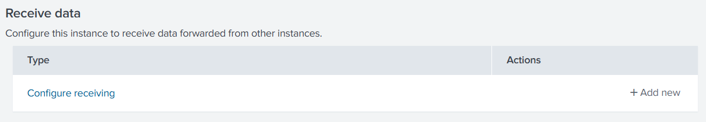
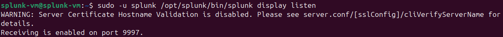
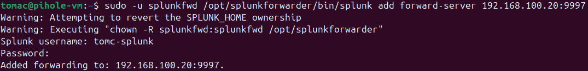
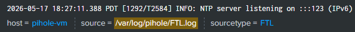

# Pi-Hole Forwarder Deployment Guide

---

## Prerequisites

This guide assumes the following:
- Splunk Enterprise is running at `<splunk-ip>`
- Pi-Hole is running at `<pihole-ip>`
- All VMs are connected to the lab network on VMnet3

Refer to the following guides if these prerequisites are not met:
- [Pi-Hole Deployment](../pihole-server/pihole-guide.md)
- [Splunk Server Deployment](../splunk-server/splunk-guide.md)

---

## Table of Contents

1. [Purpose](#1-purpose)
2. [Configure Splunk to Receive](#2-configure-splunk-to-receive)
3. [Required Technologies](#3-required-technologies)
4. [Pre-Installation Steps](#4-pre-installation-steps)
5. [Installation](#5-installation)
6. [Forwarder User Configuration](#6-forwarder-user-configuration)
7. [Initial Startup](#7-initial-startup)
8. [Forwarder Server Configuration](#8-forwarder-server-configuration)
9. [Log Monitor Configuration](#9-log-monitor-configuration)
10. [Boot Start Configuration](#10-boot-start-configuration)
11. [Verification](#11-verification)

---

## 1. Purpose

This guide covers the installation and configuration of the Splunk Universal Forwarder on the Pi-Hole virtual machine. The Splunk Universal Forwarder collects and forwards Pi-Hole DNS log data to the Splunk Enterprise instance for ingestion and analysis.

---

## 2. Configure Splunk to Receive

Before configuring the forwarder, Splunk Enterprise must be configured to accept forwarded data on port 9997. Log into the Splunk web interface from the Windows host and navigate to:

**Settings → Forwarding and Receiving → Receive Data → Configure Receiving → New Receiving Port**

Enter port `9997` and click **Save**.



Verify the receiving port is active on the Splunk VM:

```bash
sudo -u splunk /opt/splunk/bin/splunk display listen
```



---

## 3. Required Technologies

| Component | Version | Purpose |
|-----------|---------|---------|
| Splunk Universal Forwarder | 10.2.3 | Log forwarding agent |
| Firefox | Latest | Required to access Splunk download page |
| Pi-Hole | v6.4.2 | Source of DNS query logs being forwarded |

---

## 4. Pre-Installation Steps

Firefox, or another web browser, must be installed on the Pi-Hole VM to access the Splunk Universal Forwarder download page:

```bash
sudo apt install firefox -y
firefox
```

Download the Splunk Universal Forwarder from the Splunk website. A free account is required:

https://www.splunk.com/en_us/download/universal-forwarder.html

After logging in, select **Linux** as the platform and copy the provided `wget` command to download the `.deb` package directly in the Pi-Hole VM terminal.

---

## 5. Installation

The following command installs the Splunk Universal Forwarder to `/opt/splunkforwarder` on the virtual machine:

```bash
sudo dpkg -i splunkforwarder-*.deb
```

---

## 6. Forwarder User Configuration

A dedicated system user was configured to run the Splunk Universal Forwarder, following the principle of least privilege:

```bash
sudo useradd -m -r splunkfwd
sudo chown -R splunkfwd:splunkfwd /opt/splunkforwarder
```

---

## 7. Initial Startup

Start the Splunk Universal Forwarder as the dedicated `splunkfwd` user:

```bash
sudo -u splunkfwd /opt/splunkforwarder/bin/splunk start --accept-license
```

During startup, you will be prompted to create a username and password. Save these credentials for future use.

---

## 8. Forwarder Server Configuration

The forwarder was configured to send logs to the Splunk Enterprise instance at `<splunk-ip>` on port `9997`. The connection was verified using the following commands:

```bash
sudo -u splunkfwd /opt/splunkforwarder/bin/splunk add forward-server <splunk-ip>:9997
sudo -u splunkfwd /opt/splunkforwarder/bin/splunk list forward-server
```



---

## 9. Log Monitor Configuration

The following Pi-Hole logs were added to the forwarding list. These are the primary logs providing Splunk Enterprise with insight into DNS activity captured by Pi-Hole:

```bash
sudo -u splunkfwd /opt/splunkforwarder/bin/splunk add monitor /var/log/pihole/pihole.log
sudo -u splunkfwd /opt/splunkforwarder/bin/splunk add monitor /var/log/pihole/FTL.log
```

Restart the forwarder to apply the changes:

```bash
sudo -u splunkfwd /opt/splunkforwarder/bin/splunk restart
```

---

## 10. Boot Start Configuration

The forwarder was configured to start automatically on boot to ensure consistent log forwarding and prevent gaps in Splunk data:

```bash
sudo /opt/splunkforwarder/bin/splunk enable boot-start -user splunkfwd
sudo systemctl daemon-reload
sudo systemctl enable SplunkForwarder
sudo systemctl start SplunkForwarder
sudo systemctl is-enabled SplunkForwarder
```

---

## 11. Verification

To verify that Pi-Hole logs are being forwarded and ingested correctly, access the Splunk web interface from the Windows host and run the following searches in the **Search & Reporting** app:

```bash
index=* source="/var/log/pihole/pihole.log"
index=* source="/var/log/pihole/FTL.log"
```



Both log sources should return results confirming successful forwarding, ingestion, and the ability to analyze.

---

*Previous: [Splunk Server Deployment](../splunk-server/splunk-guide.md)*

*Next: [Windows Forwarder Deployment](windows-forwarder-setup.md)*