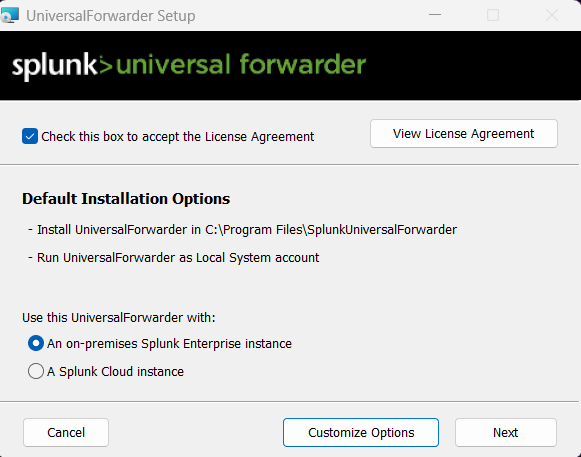
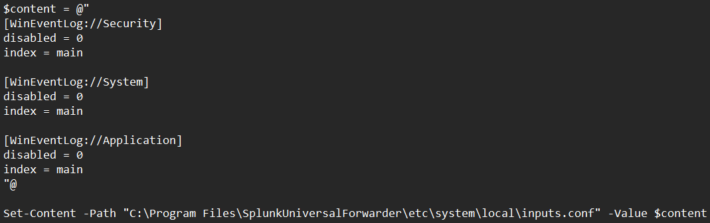
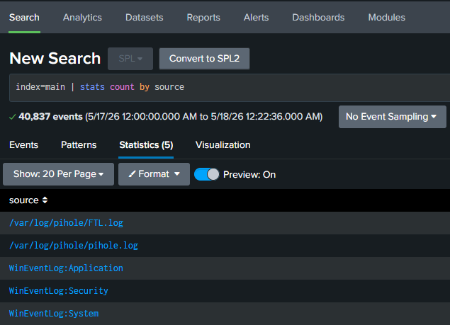

# Windows Forwarder Deployment Guide

---

## Prerequisites

This guide assumes the following:
- Splunk Enterprise is running at `<splunk-ip>`
- Pi-Hole Forwarder has been configured and is actively forwarding logs
- All VMs are connected to the lab network on VMnet3

Refer to the following guides if these prerequisites are not met:
- [Splunk Server Deployment](../splunk-server/splunk-guide.md)
- [Pi-Hole Forwarder Deployment](pihole-forwarder-setup.md)

---

## Table of Contents

1. [Purpose](#1-purpose)
2. [Required Technologies](#2-required-technologies)
3. [Pre-Installation Steps](#3-pre-installation-steps)
4. [Installation](#4-installation)
5. [Log Monitor Configuration](#5-log-monitor-configuration)
6. [Verification](#6-verification)

---

## 1. Purpose

This guide covers the installation and configuration of the Splunk Universal Forwarder on the Windows host machine. The forwarder collects and forwards Windows Event Logs to the Splunk Enterprise instance, enabling security monitoring and analysis of host machine activity.

---

## 2. Required Technologies

| Component | Version | Purpose |
|-----------|---------|---------|
| Splunk Universal Forwarder | 10.2.3 | Log forwarding agent |
| PowerShell | Built-in | Used to create inputs.conf and manage forwarding |
| Windows Event Log | Built-in | Source of Security, System, and Application logs |
| Web Browser | Latest | Required to access Splunk installer web page |

---

## 3. Pre-Installation Steps

Download the Splunk Universal Forwarder from the Splunk website on the Windows host. A free account is required:

https://www.splunk.com/en_us/download/universal-forwarder.html

After logging in, select **Windows** as the platform and download the 64-bit `.msi` installer.

---

## 4. Installation

Run the `.msi` installer and make the following selections when prompted by the installation wizard:

| Prompt | Selection |
|--------|-----------|
| Instance Type | On-Premises Splunk Enterprise Instance |
| Deployment Server | None — Skipped |
| Receiving Indexer Hostname | `<splunk-ip>` |
| Receiving Indexer Port | 9997 |



---

## 5. Log Monitor Configuration

Following installation, the forwarder was configured to monitor Windows Event Logs by creating an `inputs.conf` file specifying the logs to be forwarded. The file was placed in the Splunk Universal Forwarder configuration directory:

`C:\Program Files\SplunkUniversalForwarder\etc\system\local\inputs.conf`

The following configuration was written to the file using PowerShell as Administrator. Security, System, and Application logs were selected — covering login attempts, privilege use, service events, hardware events, and software errors respectively.

```powershell
$content = @"
[WinEventLog://Security]
disabled = 0
index = main

[WinEventLog://System]
disabled = 0
index = main

[WinEventLog://Application]
disabled = 0
index = main
"@
Set-Content -Path "C:\Program Files\SplunkUniversalForwarder\etc\system\local\inputs.conf" -Value $content
```



Restart the forwarder to apply the configuration:

```powershell
Restart-Service -Name "SplunkForwarder"
```

---

## 6. Verification

Verify the forwarder is connected and actively forwarding to Splunk:

```powershell
& "C:\Program Files\SplunkUniversalForwarder\bin\splunk.exe" list forward-server
```

Confirm log ingestion by running the following search in the Splunk **Search & Reporting** app:

```bash
index=main | stats count by source
```



All three log sources — Security, System, and Application — should be visible confirming successful forwarding and ingestion from the Windows host.

---

*Previous: [Pi-Hole Forwarder Deployment](pihole-forwarder-setup.md)*

*Next: [Splunk Server — Field Extraction](../splunk-server/splunk-guide.md#8-field-extraction)*