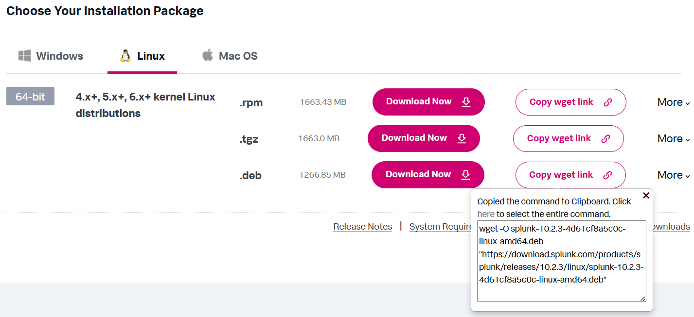
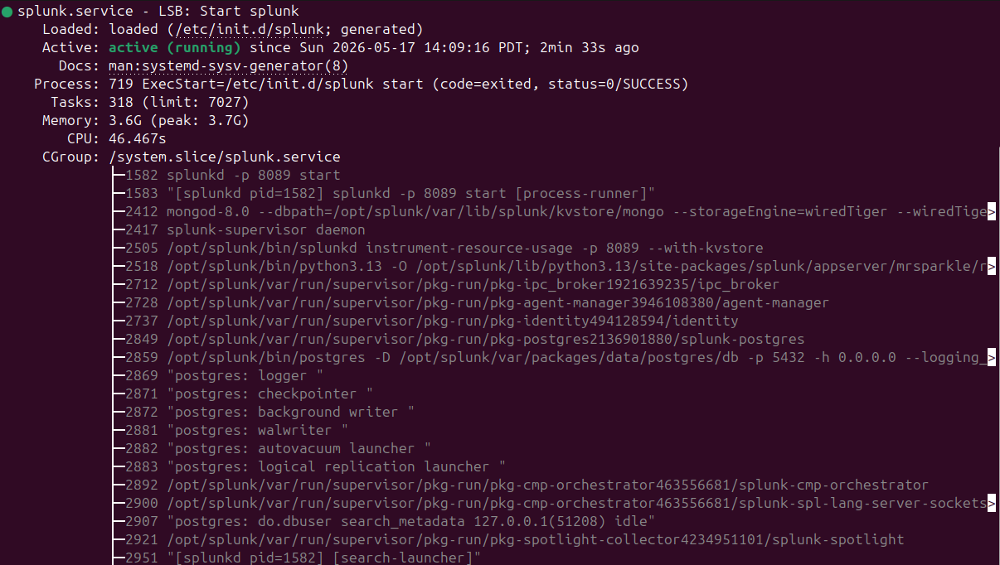
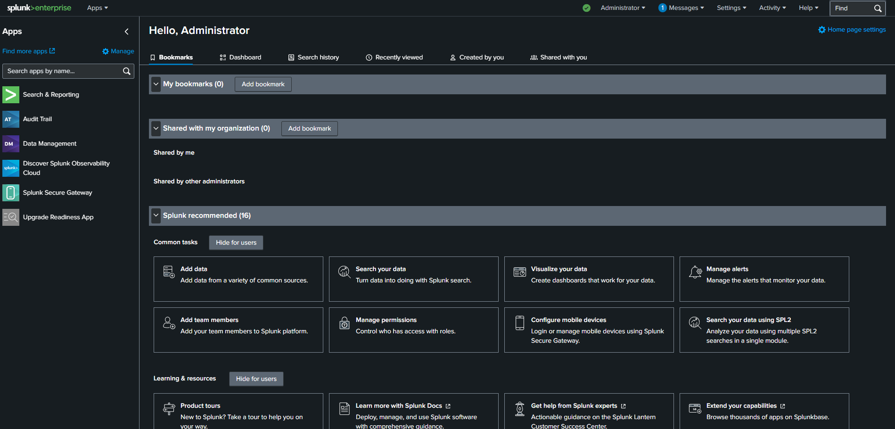
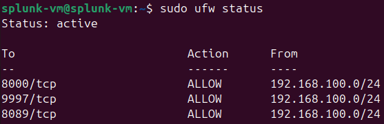
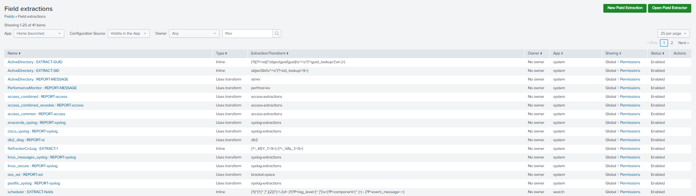
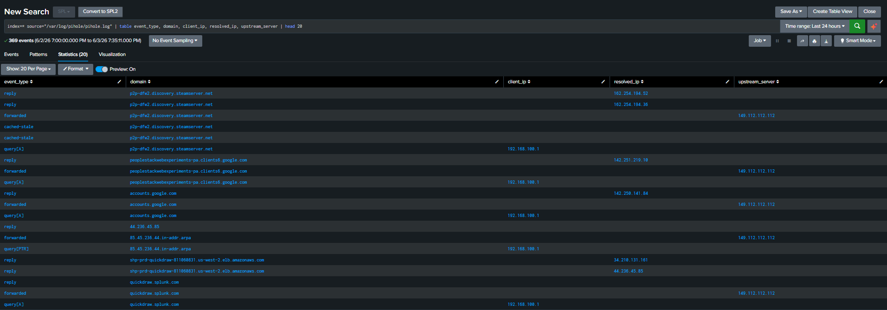
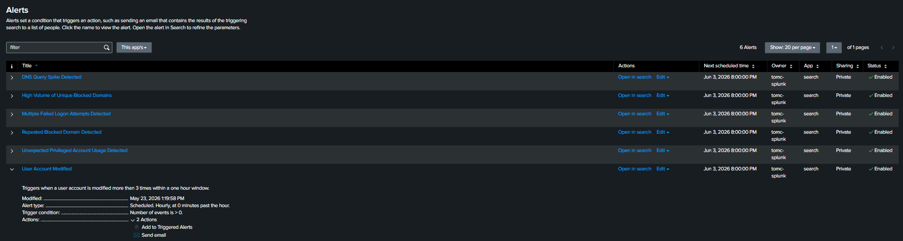
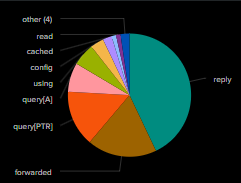
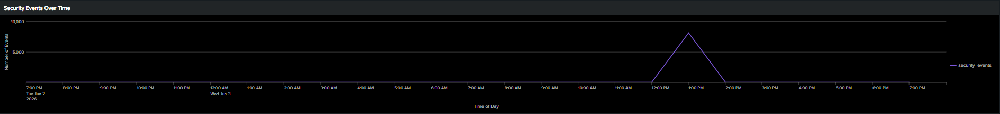

# Splunk Server Deployment Guide

---

## Prerequisites

This guide assumes the following:
- VMware Workstation Pro is installed on the host machine
- Pi-Hole VM is deployed and running at `<pihole-ip>`
- The Pi-Hole deployment guide has been completed

This guide must be completed before proceeding to:
- [Splunk Universal Forwarder Deployment](../splunk-forwarder/pihole-forwarder-setup.md)

---

## Table of Contents

1. [Purpose](#1-purpose)
2. [Required Technologies](#2-required-technologies)
3. [Virtual Machine Specifications](#3-virtual-machine-specifications)
4. [Network Configuration](#4-network-configuration)
5. [Ubuntu Installation](#5-ubuntu-installation)
6. [Splunk Enterprise Installation](#6-splunk-enterprise-installation)
7. [Virtual Machine Hardening](#7-virtual-machine-hardening)
8. [Field Extraction](#8-field-extraction)
9. [Alerting and Detection](#9-alerting-and-detection)
10. [Dashboards](#10-dashboards)
11. [Testing and Verification](#11-testing-and-verification)

---

## 1. Purpose

This guide covers the deployment and configuration of a Splunk Enterprise virtual machine within a homelab SIEM environment. Splunk Enterprise serves two roles in this lab:

- **SIEM Platform:** Ingests, indexes, and analyzes log data forwarded from the Pi-Hole VM and Windows host machine.
- **Detection and Alerting:** Provides real-time alerts and dashboard functionality for identifying abnormal network behavior and indicators of compromise.

---

## 2. Required Technologies

| Component | Version | Purpose |
|-----------|---------|---------|
| VMware Workstation Pro | Latest | Hypervisor hosting the Splunk VM |
| Ubuntu Desktop | 24.04.4 LTS | Guest OS |
| Splunk Enterprise | Latest | SIEM platform for log ingestion and analysis |
| Splunk Universal Forwarder | Latest | Forwards Pi-Hole and Windows logs to Splunk |
| UFW | 0.36.2 | Firewall management |
| unattended-upgrades | Built-in | Automated security updates |

---

## 3. Virtual Machine Specifications

Create a new virtual machine in VMware Workstation Pro with the following specifications:


> **Note:** Remove the USB Controller, Sound Card, CD/DVD (SATA), and Floppy Drive from the VM hardware configuration. CD/DVD 2 (SATA) should not be deleted.

> **Note:** Take snapshots throughout installation and configuration to allow reverting to a previous state if an error occurs.

---

## 4. Network Configuration

The Splunk VM uses a single network adapter on VMnet3. VMnet8 is temporarily attached during initial setup for internet access and removed upon completion.

### 4.1 Network Interface

| Interface | VMnet | IP Address | Type | Role |
|-----------|-------|------------|------|------|
| ens32 | VMnet3 (Host-Only) | `<splunk-ip>` | Static | Lab network |

> **Note:** DHCP is disabled on VMnet3. All lab VMs use static IPs for consistent addressing.

### 4.2 Static IP Configuration

Edit the Netplan configuration file:

```bash
sudo nano /etc/netplan/50-cloud-init.yaml
```

Add the following configuration:

```yaml
network:
  version: 2
  ethernets:
    ens32:
      dhcp4: no
      addresses:
        - <splunk-ip>/24
```

Apply the configuration:

```bash
sudo netplan apply
```

### 4.3 Netplan Permission Hardening

```bash
sudo chmod 600 /etc/netplan/50-cloud-init.yaml
sudo chmod 600 /etc/netplan/01-network-manager-all.yaml
```

---

## 5. Ubuntu Installation

### 5.1 Disk Image

| Property | Value |
|----------|-------|
| Distribution | Ubuntu Desktop |
| Version | 24.04.4 LTS (Noble Numbat) |
| Architecture | 64-bit (AMD64) |
| Image Type | .iso |
| Source | https://ubuntu.com/download/alternative-downloads |
| LTS Support Until | April 2029 |

### 5.2 Installation Configuration

| Screen | Selection |
|--------|-----------|
| Internet Connection | Do not connect |
| Installation Type | Interactive Installation |
| App Selection | Default |
| Third Party Software | None |
| Disk Configuration | Erase disk and install |

---

## 6. Splunk Enterprise Installation

### 6.1 Pre-Installation Steps

Temporarily attach VMnet8 to the VM for internet access:

1. Shut down the virtual machine
2. Open virtual machine settings
3. Click **Add → Network Adapter** and set to VMnet8
4. Launch the virtual machine

Update the system:

```bash
sudo apt update && sudo apt upgrade -y
```

Download the Splunk Enterprise `.deb` installer from the Splunk website. A free account is required:

https://www.splunk.com/en_us/download/splunk-enterprise.html

Select **Linux** as the platform and copy the provided `wget` command to download directly in the terminal.



> **Note:** Remove VMnet8 after installation is complete to keep the Splunk VM fully isolated on the lab network.

### 6.2 Installation

```bash
sudo dpkg -i splunk-*.deb
```

### 6.3 Splunk User Configuration

Create a dedicated non-root user to run the Splunk service:

```bash
sudo useradd -m -r splunk
sudo chown -R splunk:splunk /opt/splunk
```

### 6.4 Initial Startup

```bash
sudo -u splunk /opt/splunk/bin/splunk start --accept-license
```

You will be prompted to create an admin username and password. Save these credentials for future use.

### 6.5 Boot Start Configuration

```bash
sudo /opt/splunk/bin/splunk enable boot-start -user splunk
```

### 6.6 Verification

```bash
sudo systemctl list-units --type=service | grep -i splunk
```



Access the Splunk web interface from the Windows host browser using the URL provided during startup and log in with your saved credentials.



---

## 7. Virtual Machine Hardening

### 7.1 Hardware Hardening

| Component | Action |
|-----------|--------|
| USB Controller | Removed |
| Sound Card | Removed |
| CD/DVD (SATA) | Removed |
| Floppy Drive | Removed |

### 7.2 Service Hardening

```bash
sudo systemctl disable --now avahi-daemon cups cups-browsed kerneloops ModemManager
sudo systemctl disable --now avahi-daemon.socket
```

### 7.3 Firewall Configuration (UFW)

Install UFW and set default rules:

```bash
sudo apt install ufw -y
sudo ufw default deny incoming
sudo ufw default allow outgoing
```

Allow only required ports:

| Port | Protocol | Purpose |
|------|----------|---------|
| 8000 | TCP | Splunk web interface |
| 9997 | TCP | Log receiving from Universal Forwarder |
| 8089 | TCP | Splunk management port |

```bash
sudo ufw allow from <lab-network>/24 to any port 8000 proto tcp
sudo ufw allow from <lab-network>/24 to any port 9997 proto tcp
sudo ufw allow from <lab-network>/24 to any port 8089 proto tcp
sudo ufw enable
sudo ufw status
```



### 7.4 Automated Security Updates

```bash
sudo apt install unattended-upgrades -y
sudo dpkg-reconfigure --priority=low unattended-upgrades
```

When prompted, select **YES** to automatically install stable updates.

```bash
sudo systemctl status unattended-upgrades
```


### 7.5 VMnet8 Removal

1. Shut down the virtual machine
2. Open virtual machine settings
3. Select the VMnet8 network adapter and click **Remove**
4. Launch the virtual machine

Verify ens32 is the only active interface:

```bash
ip a
```

---

## 8. Field Extraction

> **Prerequisites:** Complete the [Splunk Universal Forwarder Deployment](../splunk-forwarder/pihole-forwarder-setup.md) before proceeding. Logs must be actively forwarding before field extractions can be configured.

Field extraction converts raw log data into searchable key-value pairs. Pi-Hole DNS logs use a custom sourcetype that Splunk doesn't natively parse, requiring four custom extractions. Windows event logs are automatically parsed and require no custom extractions.

Custom extractions were created via **Settings → Fields → Field Extractions**.



| Field | Extraction Name | Applies To |
|-------|----------------|------------|
| event_type, domain | pihole_dns_fields | All Pi-Hole events |
| client_ip | pihole_client_ip | query[A] events |
| resolved_ip | pihole_resolved_ip | Reply events |
| upstream_server | pihole_upstream_server | Forwarded events |

All extractions apply to sourcetype `pihole-too_small` using the following regex patterns:

**event_type and domain:**
```bash
dnsmasq[\d+]:\s+(?P<event_type>\S+)\s+(?P<domain>[^\s]+)
```

**client_ip:**
```bash
dnsmasq[\d+]:\s+query\S*\s+\S+\s+from\s+(?P<client_ip>\d+.\d+.\d+.\d+)
```

**resolved_ip:**
```bash
dnsmasq[\d+]:\s+reply\s+\S+\s+is\s+(?P<resolved_ip>\d+.\d+.\d+.\d+)
```

**upstream_server:**
```bash
dnsmasq[\d+]:\s+forwarded\s+\S+\s+to\s+(?P<upstream_server>\d+.\d+.\d+.\d+)
``` 
Verify extractions using the following Splunk search:
```bash
index=* source="/var/log/pihole/pihole.log" | table event_type, domain, client_ip, resolved_ip, upstream_server | head 20
```



---

## 9. Alerting and Detection

Six alerts were configured to detect suspicious behavior across Pi-Hole DNS logs and Windows security logs. All alerts run on an hourly schedule and trigger an email notification.

### 9.1 Windows Event Codes

| Event Code | Description | Severity |
|------------|-------------|----------|
| 4624 | Successful logon | High |
| 4625 | Failed logon | High |
| 4672 | Special privileges assigned | High |
| 4738 | User account changed | Medium |
| 4648 | Logon with explicit credentials | Medium |
| 5379 | Credential Manager credentials read | Medium |

### 9.2 Pi-Hole DNS Alerts

**Alert 1 — DNS Query Spike**

Triggers when DNS query volume exceeds 1,000 queries per minute, indicating a potential DNS flood or malware beaconing.

```bash
index=* source="/var/log/pihole/pihole.log" | timechart span=1m count as dns_queries | where dns_queries > 1000
```

**Alert 2 — Repeated Blocked Domain**

Triggers when the same domain is blocked more than 200 times per hour, indicating persistent attempts to reach a blocked domain.

```bash
index=* source="/var/log/pihole/pihole.log" earliest=-1h | rex field=_raw "gravity blocked (?P<blocked_domain>\S+)" | stats count as block_count by blocked_domain | where block_count > 200 | sort -block_count
```

**Alert 3 — High Volume of Unique Blocked Domains**

Triggers when more than 50 unique domains are blocked per hour, indicating potential command and control beaconing or DNS tunneling.

```bash
index=* source="/var/log/pihole/pihole.log" earliest=-1h | rex field=_raw "gravity blocked (?P<blocked_domain>\S+)" | stats dc(blocked_domain) as unique_blocked_domains | where unique_blocked_domains > 50
```

### 9.3 Windows Host Alerts

**Alert 4 — Multiple Failed Logon Attempts**

Triggers when more than 5 failed logon attempts occur within 5 minutes, indicating a potential brute force attack.

```bash
index=main host="<windows-hostname>" source="WinEventLog:Security" EventCode=4625 earliest=-5m | stats count as failed_logons | where failed_logons > 5
``` 

**Alert 5 — Unexpected Privileged Account Usage**

Triggers when a non-system account is assigned special privileges more than 5 times per hour. Built-in system accounts are excluded to prevent false positives.

```bash
index=main host="<windows-hostname>" source="WinEventLog:Security" EventCode=4672 earliest=-1h | where Account_Name!="SYSTEM" AND Account_Name!="LOCAL SERVICE" AND Account_Name!="NETWORK SERVICE" | stats count as privileged_logons by Account_Name | where privileged_logons > 5 | sort -privileged_logons
```
**Alert 6 — User Account Modified**

Triggers when a user account is modified more than 3 times per hour. Machine accounts are excluded to prevent false positives.

```bash
index=main host="<windows-hostname>" source="WinEventLog:Security" EventCode=4738 earliest=-1h | where Account_Name!="<windows-hostname>$" | stats count as account_changes by Account_Name | where account_changes > 3 | sort -account_changes
```



---

## 10. Dashboards

Two dashboards were created via **Dashboards → Create New Dashboard** to provide visual overviews of DNS and security activity.

### 10.1 Pi-Hole DNS Dashboard

| Panel | Chart Type | Purpose |
|-------|------------|---------|
| DNS Query Volume Over Time | Line Chart | Shows DNS traffic patterns and spikes |
| Top 10 Queried Domains | Bar Chart | Identifies most frequently queried domains |
| Top 10 Blocked Domains | Bar Chart | Shows most frequently blocked domains |
| Blocked vs Allowed Query Ratio | Pie Chart | Visual summary of Pi-Hole blocking effectiveness |



### 10.2 Windows Security Events Dashboard

| Panel | Chart Type | Purpose |
|-------|------------|---------|
| Security Events Over Time | Line Chart | Shows security event volume and patterns |
| Top Windows Event Codes | Bar Chart | Identifies most frequent Event IDs |
| Logon Activity Over Time | Line Chart | Tracks successful and failed logon attempts |
| Top Accounts by Event Count | Bar Chart | Identifies most active accounts by event volume |



---

## 11. Testing and Verification

End-to-end testing was conducted to verify the full log ingestion pipeline, alert functionality, and dashboard accuracy.

### 11.1 Blocked Domain Simulation

Query three known advertising domains from the Windows host PowerShell:

```powershell
nslookup doubleclick.net <pihole-ip>
nslookup googleads.g.doubleclick.net <pihole-ip>
nslookup pagead2.googlesyndication.com <pihole-ip>
```

All three should return `0.0.0.0`. 

**Confirm in Splunk:**

```bash
index=* source="/var/log/pihole/pihole.log" | rex field=_raw "gravity blocked (?P<blocked_domain>\S+)" | where blocked_domain="doubleclick.net" OR blocked_domain="googleads.g.doubleclick.net" OR blocked_domain="pagead2.googlesyndication.com" | table _time blocked_domain | sort -_time
```

### 11.2 DNS Spike Simulation

Send 1,500 DNS queries from the Windows host:

```powershell
1..1500 | ForEach-Object { Resolve-DnsName -Name "google.com" -Server <pihole-ip> -ErrorAction SilentlyContinue }
```

Confirm the spike is visible in the Pi-Hole DNS Activity dashboard.

### 11.3 Failed Logon Simulation

Simulate six failed logon attempts on the Windows host:

```powershell
$credential = New-Object System.Management.Automation.PSCredential("fakeuser", (ConvertTo-SecureString "wrongpassword" -AsPlainText -Force))
1..6 | ForEach-Object {
    try { Start-Process cmd -Credential $credential -ErrorAction Stop }
    catch {}
}
```

**Confirm in Splunk:**

index=main host="<windows-hostname>" source="WinEventLog:Security" EventCode=4625 | table _time Account_Name | sort -_time | head 10

### 11.4 Pipeline Verification Summary

| Test | Result |
|------|--------|
| Pi-Hole DNS blocking | Confirmed — 0.0.0.0 returned |
| Pi-Hole log forwarding to Splunk | Confirmed — entries visible in Splunk |
| DNS spike detection | Confirmed — spike visible in dashboard |
| Windows log forwarding to Splunk | Confirmed — failed logon entries visible |
| Alert configuration | Confirmed — 6 alerts active and scheduled |
| Dashboard functionality | Confirmed — all panels populated |

---

*Previous: [Pi-Hole Deployment](../pihole-server/pihole-guide.md)*

*Next: [Splunk Universal Forwarder Deployment](../splunk-forwarder/pihole-forwarder-setup.md)*